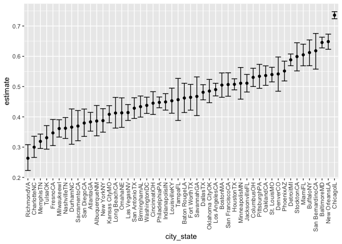

p8105_hw5_jdr2191
================

``` r
library(tidyverse)
```

    ## ── Attaching packages ─────────────────────────────────────── tidyverse 1.3.1 ──

    ## ✓ ggplot2 3.3.5     ✓ purrr   0.3.4
    ## ✓ tibble  3.1.5     ✓ dplyr   1.0.7
    ## ✓ tidyr   1.1.4     ✓ stringr 1.4.0
    ## ✓ readr   2.0.2     ✓ forcats 0.5.1

    ## ── Conflicts ────────────────────────────────────────── tidyverse_conflicts() ──
    ## x dplyr::filter() masks stats::filter()
    ## x dplyr::lag()    masks stats::lag()

``` r
library(viridis)
```

    ## Loading required package: viridisLite

## Problem 1

``` r
homicides_df = 
  read_csv("homicides/homicide-data.csv", na = c("", "Unknown")) %>% 
  mutate(
    city_state = str_c(city, state),
    resolution = case_when(
      disposition == "Closed without arrest" ~ "unsolved",
      disposition == "Open/No arrest" ~ "unsolved",
      disposition == "Closed by arrest" ~ "solved")
    ) %>% 
  relocate(city_state) %>% 
  filter(city_state != "TulsaAL")
```

Let’s focus on Baltimore MD

``` r
baltimore_df = 
  homicides_df %>% 
  filter(city_state == "BaltimoreMD")

baltimore_summary = baltimore_df %>% 
  summarize(
    unsolved = sum(resolution == "unsolved"),
    n = n()
  )

balimtore_test = 
  prop.test(x = baltimore_summary %>% pull(unsolved), 
          n = baltimore_summary %>% pull(n))

balimtore_test %>% 
  broom::tidy()
```

    ## # A tibble: 1 × 8
    ##   estimate statistic  p.value parameter conf.low conf.high method    alternative
    ##      <dbl>     <dbl>    <dbl>     <int>    <dbl>     <dbl> <chr>     <chr>      
    ## 1    0.646      239. 6.46e-54         1    0.628     0.663 1-sample… two.sided

Let’s try to iterate across cities

``` r
prop_test_function = function(city_df) {

  city_summary = 
    city_df %>% 
    summarize(
      unsolved = sum(resolution == "unsolved"),
      n = n()
    )
  
  city_test = 
    prop.test(x = city_summary %>% pull(unsolved), 
            n = city_summary %>% pull(n))
  
  return(city_test)
}
```

Let’s iterate across all cities

``` r
results_df = 
  homicides_df %>% 
  nest(data = uid:resolution) %>% 
  mutate(
    test_results = map(data, prop_test_function),
    tidy_results = map(test_results, broom::tidy)
  ) %>% 
  select(city_state, tidy_results) %>% 
  unnest(tidy_results) %>% 
  select(city_state, estimate, starts_with("conf"))
```

Try to make a plot showing estimates and confidence intervals

``` r
results_df %>% 
  mutate(city_state = fct_reorder(city_state, estimate)) %>% 
  ggplot(aes(x = city_state, y = estimate)) +
  geom_point() +
  geom_errorbar(aes(ymin = conf.low, ymax = conf.high)) + 
  theme(axis.text.x = element_text(angle = 90, vjust = 0.5, hjust = 1))
```

<!-- -->

``` r
homicides_df %>% 
  group_by(city_state) %>% 
  summarize(
    unsolved = sum(resolution == "unsolved"),
    n = n()
  ) %>% 
  mutate(
    test_results = map2(unsolved, n, prop.test), 
    tidy_results = map(test_results, broom::tidy)
  ) %>% 
  select(city_state, tidy_results) %>% 
  unnest(tidy_results) %>% 
  select(city_state, estimate, starts_with("conf"))
```

    ## # A tibble: 50 × 4
    ##    city_state    estimate conf.low conf.high
    ##    <chr>            <dbl>    <dbl>     <dbl>
    ##  1 AlbuquerqueNM    0.386    0.337     0.438
    ##  2 AtlantaGA        0.383    0.353     0.415
    ##  3 BaltimoreMD      0.646    0.628     0.663
    ##  4 Baton RougeLA    0.462    0.414     0.511
    ##  5 BirminghamAL     0.434    0.399     0.469
    ##  6 BostonMA         0.505    0.465     0.545
    ##  7 BuffaloNY        0.612    0.569     0.654
    ##  8 CharlotteNC      0.300    0.266     0.336
    ##  9 ChicagoIL        0.736    0.724     0.747
    ## 10 CincinnatiOH     0.445    0.408     0.483
    ## # … with 40 more rows

## Problem 2

Create a tidy dataframe containing data from all participants, including
the subject ID, arm, and observations over time.

``` r
files_df =
  tibble(
    participant_id = list.files("data")) 

files2_df =
  files_df %>%
  mutate(file_contents = map(participant_id , function(x) read_csv(file.path("data", x)))) %>%
  mutate(participant_id = gsub(".csv", "", participant_id)) %>%
  unnest(file_contents) %>%
  pivot_longer(
    cols = starts_with("week"),
    names_to = "week",
    names_prefix = "week_",
    values_to = "value",
  ) %>%
  separate(participant_id, c("study_arm", "subject_id"), sep = "_") %>%
  mutate(study_arm = ifelse(study_arm == "con","Control","Experimental"))
```

Make a spaghetti plot showing observations on each subject over time,
and comment on differences between groups.

``` r
files2_df %>%
  ggplot(aes(x = week, y = value)) +
  geom_line(aes(group = subject_id, color = subject_id), size = 1) +
  geom_point(aes(group = subject_id, color = subject_id)) +
  facet_grid(cols = vars(study_arm), switch = "y") + 
  scale_colour_viridis_d(option = "D") + 
  labs(x = "Week", y = "Value", col = "Subject ID") +
  theme_minimal()
```

<!-- --> There
is less variability in values over time for the control arm than for the
experimental arm. In the control arm, values seem to range from abut
-2.3 to 4 whereas for the experimental arm, values seem to range from
about -1 to 7.6. In the experimental arm, values for individuals apepar
to increase over time throughout the course of the study.

## Problem 3

``` r
set.seed(10)

iris_with_missing = 
  iris %>%
  map_df(~replace(.x, sample(1:150, 20), NA)) %>%
  mutate(Species = as.character(Species)) %>%
  janitor::clean_names()
```

Writing a function that takes a vector as an argument; replaces missing
values so that:

-   For numeric variables, you should fill in missing values with the
    mean of non-missing values

-   For character variables, you should fill in missing values with
    “virginica”

``` r
update_missing = function(x) {
  
   if (is.numeric(x)) {
     
     ifelse(is.na(x) == TRUE, mean(x, na.rm = TRUE), x)
     
   }
  
   else if (is.character(x)) {
    
    ifelse(is.na(x) == TRUE, "virginica", x)
    
  }

}
```

Applying this function to the columns of iris_with_missing using a map
statement.

``` r
iris_complete = 
  map_df(iris_with_missing, update_missing)
```
